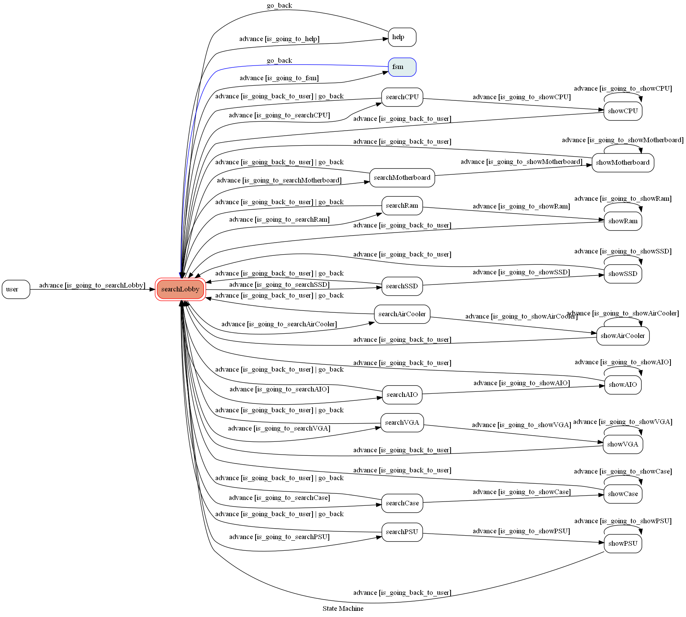

# TOC Project 2022

[](https://codeclimate.com/github/NCKU-CCS/TOC-Project-2020/maintainability)

[](https://snyk.io/test/github/NCKU-CCS/TOC-Project-2020)

A Line bot based on a finite state machine

## Setup

### Prerequisite

* Python 3.7.9
* Pipenv
* HTTPS Server

#### Install Dependency

```sh
python -m venv env
```

On Windows Powershell

```
cd env/Scripts

./Activate.ps1
```

* pygraphviz (For visualizing Finite State Machine)
  * Go to [PyGraphviz](https://pygraphviz.github.io/documentation/stable/install.html)

```
pip install -r requirements.txt
```

#### Secret Data

You should generate a `.env` file to set Environment Variables refer to our `.env.sample`.
`LINE_CHANNEL_SECRET`,  `LINE_CHANNEL_ACCESS_TOKEN`, `FSM_URL` **MUST** be set to proper values.
Otherwise, you might not be able to run your code.

#### Run Locally

You can either setup https server or using `ngrok` as a proxy.

#### a. Ngrok installation

* [ macOS, Windows, Linux](https://ngrok.com/download)

or you can use Homebrew (MAC)

```sh
brew cask install ngrok
```

**`ngrok` would be used in the following instruction**

```sh
ngrok http 5000
```

After that, `ngrok` would generate a https URL.

#### Run the sever

```sh
flask run
```

#### b. Servo

Or You can use [servo](http://serveo.net/) to expose local servers to the internet.

## Finite State Machine


